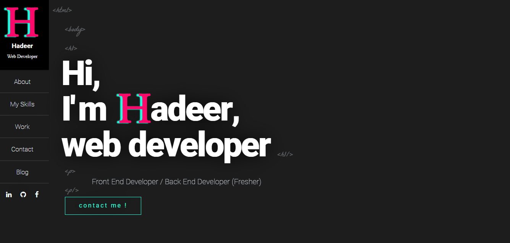

  

  

- 🌱 I’m currently learning React.JS, Angular.Js, Laravel and Android

- 💬 Ask me about mySQL, PHP, HTML, CSS3, JavaScript and Java 

- 📄 <a href= "full stack developer.docx"  > View My CV </a>

 

<h3 align="left">Connect with me:</h3>

<a

<h3 align="left">Languages and Tools:</h3>

        
     <a href="https://redux.js.org" target="_blank" rel="noreferrer"> 

