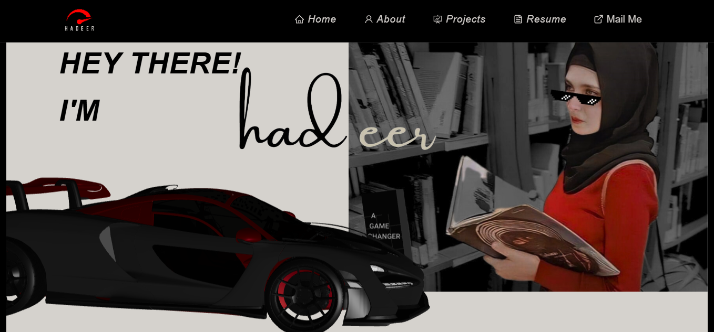
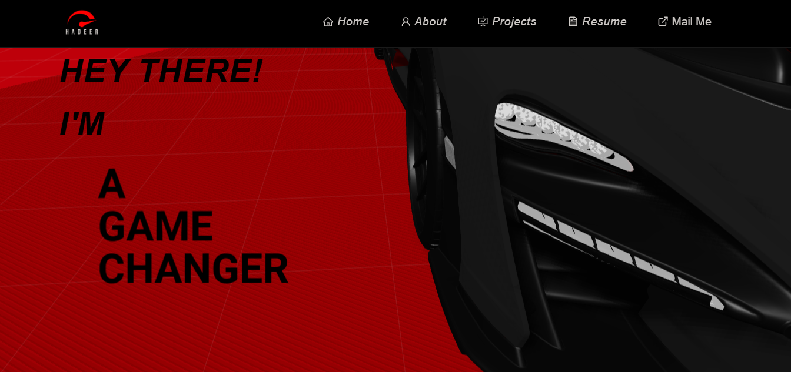

<h2 align="center">
  Get to Know Me! 
</h2>

  
  

 

  

- 🌱 I’m currently learning and developing my skills in the MERN stack and Laravel.
  
- 👩‍💻 **Professional Experience**:
  - Experienced in backend development with strong skills in Node.js, PHP, and JavaScript.
  - Skilled in database management using MySQL and MongoDB.
  - Proficient in developing APIs and creating dynamic, responsive web applications.

- 💬 **Tech Stack**: Node.js, PHP, MySQL, MongoDB, HTML, CSS3, JavaScript, and related technologies.

- 📄 <a href= "https://drive.google.com/file/d/1rNqDXL4LpAmtk9Mt1HiVHUOkSAQFY70K/view?usp=sharing"  > View My CV </a>

- <h3>🚀 View My <a href= "https://portfolio-frontend-mocha-omega.vercel.app/"  >Portfolio live on Vercel!</a></h3>
             <small>Please note: For the best experience, open it on a laptop or PC, as it’s currently not fully responsive for mobile.</small>
- <h3>🎥 View My <a href= "https://drive.google.com/file/d/1MH36kO-K_4OU7wTL2csSBGxfKG2EOb9H/view?usp=sharing"  >Portfolio Demo Video</a></h3>
- <h3>💻 View My <a href= "https://github.com/Hadeer-Hesham-Fahmy/portfolio-frontend"  >Portfolio Open Source Code</a></h3>

<h3 align="left">Connect with me:</h3>

 
<a

